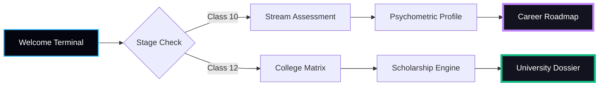

# 
🌌 StreamSelector AI

  

  
  
  
  

---

## ✨ The Vision

**StreamSelector** is a high-performance **Neural Diagnostic Engine** built to eliminate career confusion for Indian students. Designed and developed by **Pooja Singh**, it uses mathematical weighted modeling to analyze academic performance against psychometric affinities — delivering a 100% actionable career roadmap and university dossier.

🚀 **[EXPLORE THE LIVE EXPERIENCE](https://student-career-ten.vercel.app/)**

---

## 📽️ Interface Preview

<table align="center">
  <tr>
    <td width="33%"></td>
    <td width="33%"></td>
    <td width="33%"></td>
  </tr>
  <tr align="center">
    <td><b>1. Neural Intake</b></td>
    <td><b>2. Algorithm Logic</b></td>
    <td><b>3. Dynamic Dossier</b></td>
  </tr>
</table>

---

## ⚡ Power Features

### 🧠 Dual-Flow Intelligence
- **Class 10th Protocol:** Recommends optimal streams (PCM/PCB/Commerce/Arts) using weighted logic across 5 core subjects.
- **Class 12th Protocol:** Predictive matrix for 20+ Top Tier-1 Universities (BITS, VIT, Manipal, Chandigarh Univ, etc.) based on JEE/NEET/CUET scores.

### 💎 Elite Visual Architecture
- **3D Orbital Engine:** Interactive anti-gravity background that reacts to real-time mouse coordinates.
- **Dynamic Avatars:** Premium SVG avatars that transform into professional archetypes (Doctors, Engineers, Strategists) based on your unique diagnostic.

### 💰 Scholarship & Financial Matrix
- **Real-Time Waivers:** Direct calculation of fee reductions (up to 100%) based on merit slabs.
- **University Dossiers:** Deep metadata including 5-year placement trajectories, hostel fees, and official admission desk contacts.

---

## 🏗️ Technical Architecture

---

## 👩‍💻 Author

  <b>Designed & Built by Pooja Singh</b> 
  

---

StreamSelector AI • Built to empower students • HTML, CSS & JS

